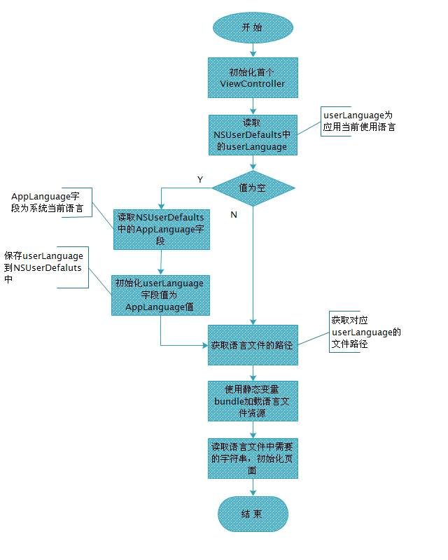

# JXLocalizable

控制本地化语言包切换的组件

本文转自[http://blog.csdn.net/xwren362922604/article/details/17190061](http://blog.csdn.net/xwren362922604/article/details/17190061)

## 语言包加载流程

## Contact

**author:** Andy Jin  
**Email:** andy_ios@163.com

##Licenses

All source code is licensed under the [MIT License](https://github.com/andy0323/JXLocalizable/blob/master/LICENSE).
